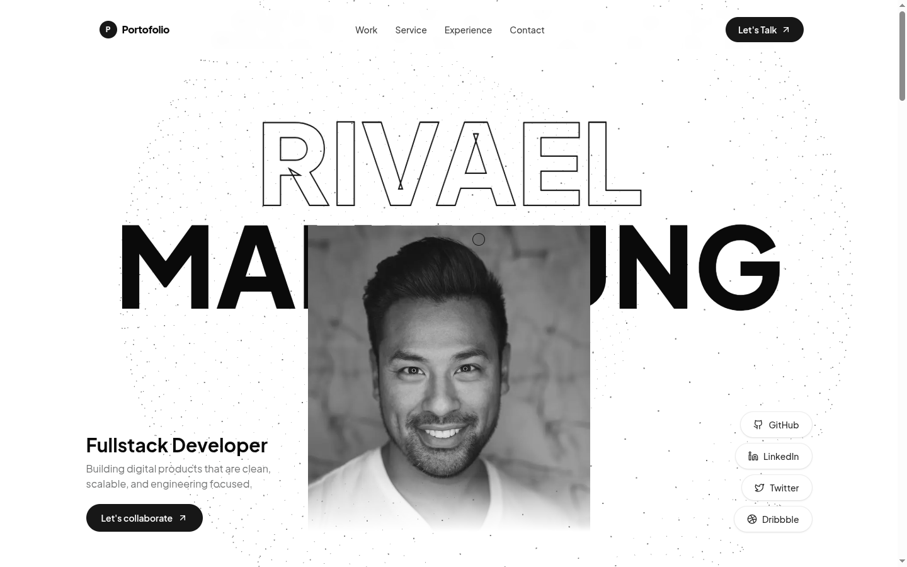
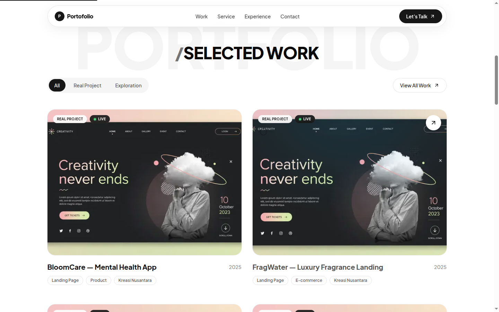
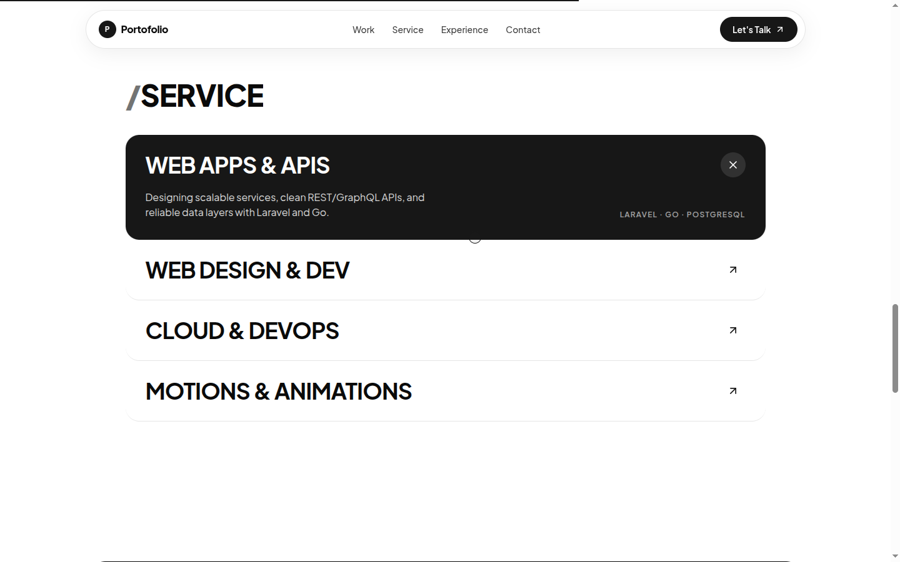
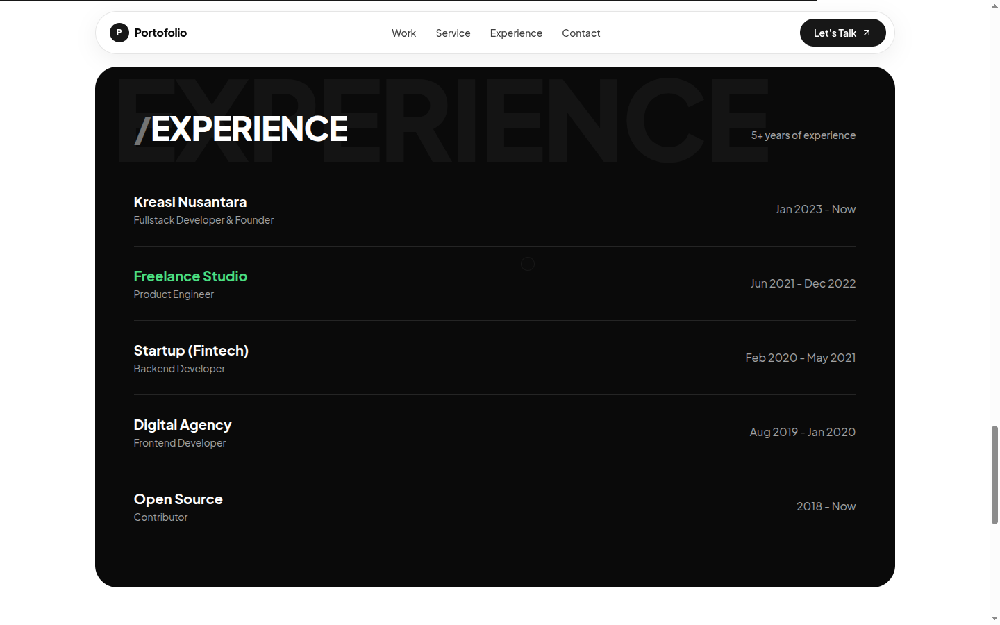
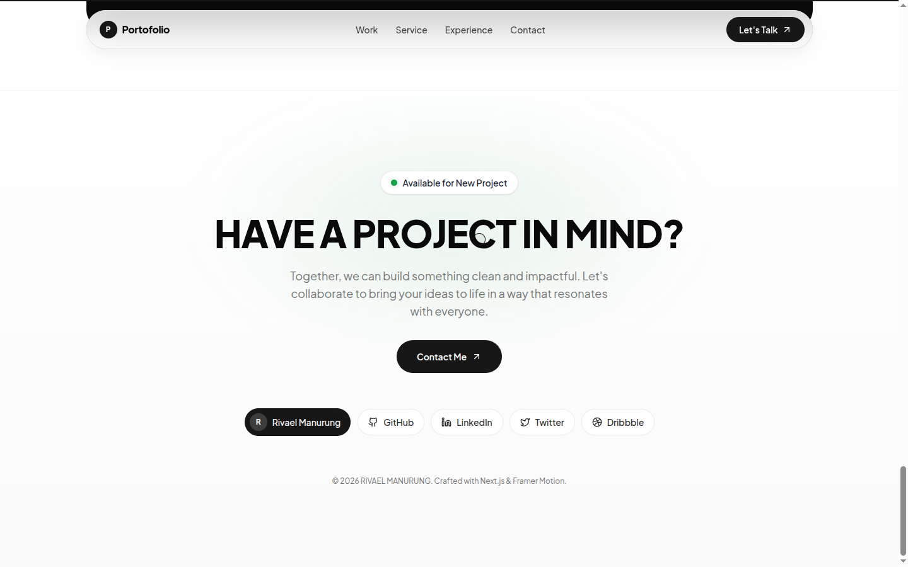
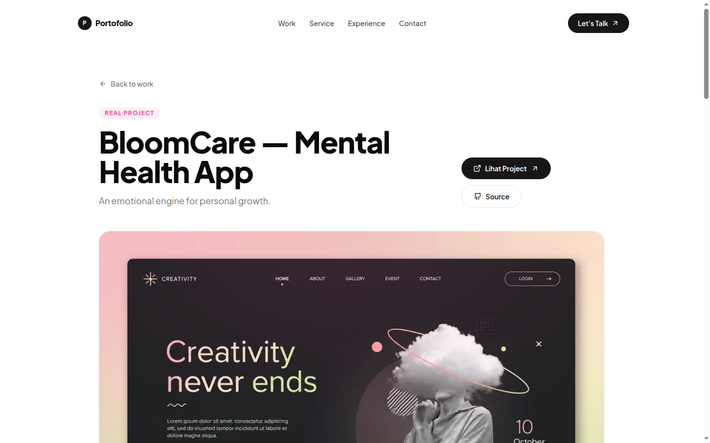
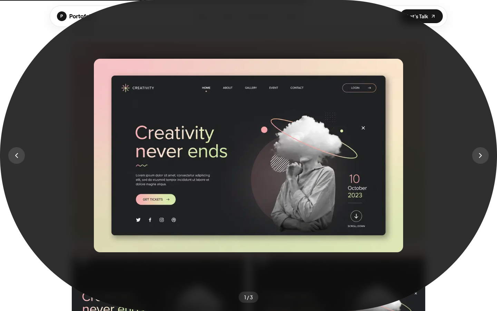

<div align="center">

# Portofolio — Rivael Manurung

An animated, 3D-enhanced personal portfolio for a fullstack developer.
Built with **Next.js 16**, **React 19**, **Framer Motion**, and **React Three Fiber**.

<!-- Lighthouse -->


<!-- Stack -->




</div>

---

## ✨ Highlights

- **WebGL 3D hero** — a pointer-reactive particle constellation (React Three Fiber), lazy-loaded on idle, WebGL-guarded, and desktop-only so mobile Core Web Vitals stay pristine.
- **Full motion design** — Lenis smooth scroll, a custom cursor, scroll progress, magnetic buttons, per-character heading reveals, `whileHover`/`whileTap` micro-interactions, scroll-linked parallax, and route transitions.
- **Filterable work grid** with animated `layoutId` transitions and a keyboard-accessible **lightbox gallery** (focus trap, arrow-key navigation, live announcements).
- **Content-driven** — every piece of copy, link, and image lives in a single [`src/lib/data.json`](src/lib/data.json). No code changes needed to update the site.
- **Accessible by default** — skip link, visible focus, ARIA on menus/accordions/filters, and `prefers-reduced-motion` honored across every animation.
- **Perfect Lighthouse on desktop** (100/100/100/100) and 97+ on throttled mobile.

## 🖼️ Screenshots

| Selected Work | Services |
| --- | --- |
|  |  |

| Experience | Contact |
| --- | --- |
|  |  |

| Project Detail | Gallery Lightbox |
| --- | --- |
|  |  |

## 🛠️ Tech Stack

| Area | Choice |
| --- | --- |
| Framework | Next.js 16 (App Router, Turbopack) |
| UI | React 19 · TypeScript 5 |
| Styling | Tailwind CSS v4 · CSS custom properties |
| Animation | Framer Motion 12 (`LazyMotion`) |
| 3D | Three.js · React Three Fiber · Drei |
| Smooth scroll | Lenis |
| Icons | lucide-react |

## 🚀 Getting Started

```bash
# install dependencies
npm install

# start the dev server
npm run dev
# → http://localhost:3000

# production build + serve
npm run build
npm run start

# lint
npm run lint
```

Requires **Node.js 18.18+**.

## 📝 Editing Content

All content is centralized in **[`src/lib/data.json`](src/lib/data.json)** — edit it and the site updates, no code required:

- `person` — name, role, tagline, email, availability
- `navLinks`, `socials`, `services`, `experiences`
- `projects[]` — each with `title`, `summary`, `overview`, `challenge`, `solution`, `highlights`, `stack`, `image`, `gallery`, and optional `liveUrl` / `repoUrl`

Fill a project's `liveUrl` to reveal the **"View Project"** button, and `repoUrl` for the **"Source"** button. A project page is statically generated at `/projects/<id>` for every entry.

Images live in [`public/`](public/) (hero at `public/hero-portrait.jpg`, project media under `public/gallery/`). Point `image` / `gallery` paths at your own files to swap them in.

## 🗂️ Project Structure

```
src/
├── app/
│   ├── layout.tsx           # root layout, fonts, metadata, smooth scroll
│   ├── page.tsx             # home (Hero → Work → Service → Experience)
│   ├── template.tsx         # route transition
│   ├── projects/[id]/       # SSG project detail pages
│   └── sitemap.ts
├── components/
│   ├── hero/                # Hero + HeroCanvas (WebGL)
│   ├── work/                # SelectedWork, ProjectCard, ProjectGallery
│   ├── service/ · experience/ · layout/
│   └── ui/                  # Button, Reveal, MagneticButton, AnimatedHeading …
└── lib/
    ├── data.json            # ← all content
    ├── data.ts              # types + helpers over data.json
    └── animation.ts         # shared motion variants/easing
```

## ♿ Accessibility & ⚡ Performance

- WCAG 2.2 AA: focus management, ARIA states, keyboard operability, AA contrast.
- `prefers-reduced-motion` disables parallax, the 3D scene, and the custom cursor, restoring the native pointer.
- LCP-safe: local, optimized `next/image` assets; the 3D chunk is deferred to idle and skipped on mobile.

## 📄 License

Personal project. All rights reserved unless stated otherwise.

<div align="center">
<sub>Crafted with Next.js &amp; Framer Motion.</sub>
</div>
